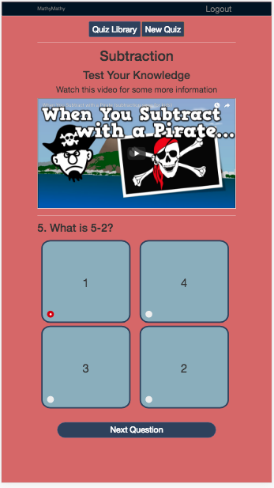
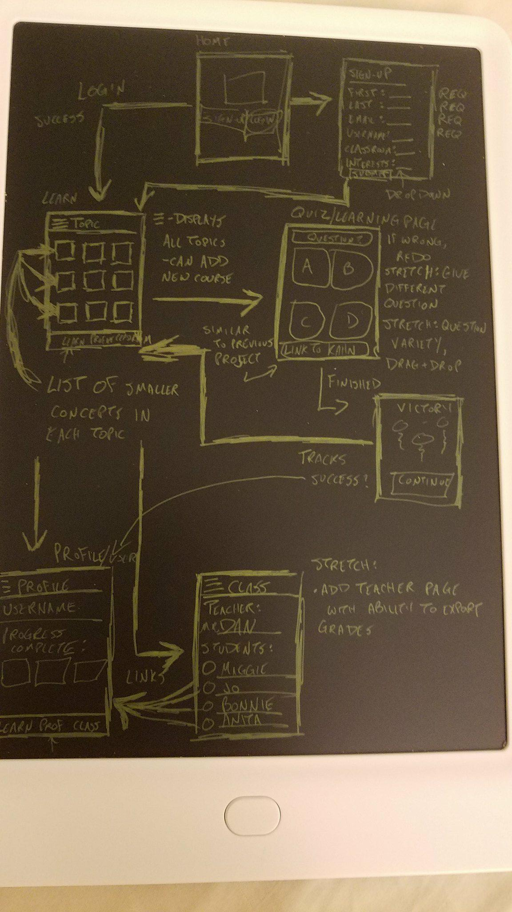
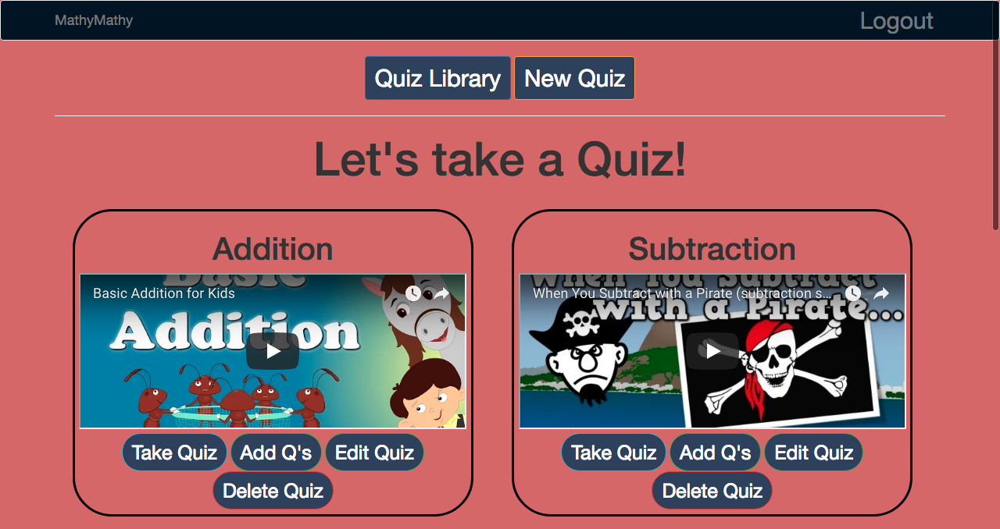
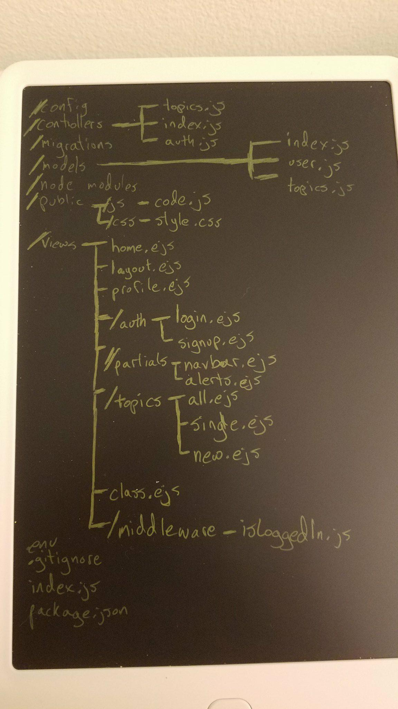
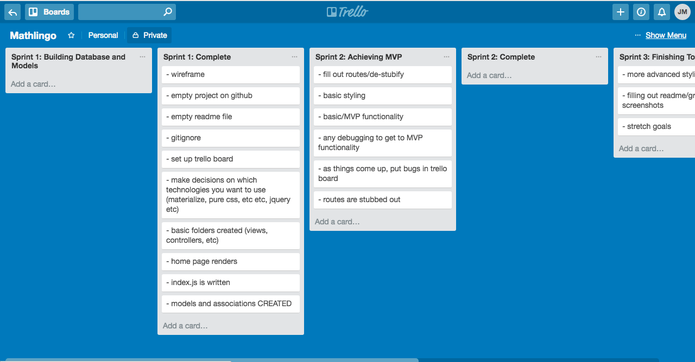

# MathyMathy

  
  

  
  

  

You'd be surprised how much you can learn from quizzing and watching youtube.

If you are a teacher, MathyMathy was designed for you. Spice up some of your lesson plans with our handy quiz-making app. Or have your students login and create their own quizzes.

Your students are dying to learn new technologies. Let's show them how it's done.

## Technical Requirements

- Deployed on Heroku  
- At least 1 API (OR sockets OR OAuth - ask if in doubt)  
- At least 2 Models Log in works  
- Sign up automatically logs me in  
- Sensible error messages for bad login info  
- At least 1 GET route  
- At least 1 POST route 
- At least 1 DELETE route 
- At least 1 PUT route  
- Appropriate use of Github
- README is included  
- gitignore properly set up Site is functional  
- Effort was put into design

## Approach Taken

*Decided on the style and wireframed the website
*Created a trello board and made an empty github
*Stubbed out folder and file system
*Created a database for users, topics, and problems
*Added a login boilerplate
*Created a simple youtube app
*Created a simple quiz app
*Stubbed routes out on main app
*Filled in GET, POST, DELETE, and PUT routes

## Built With

* [jQuery](https://code.jquery.com/jquery-3.2.1.js) - Event Handling
* [Bootstrap](https://getbootstrap.com/) - Design Layout
* [Youtube API](https://developers.google.com/youtube/) - shows videos
* [Node](https://nodejs.org/en/) - modules 

## Unsolved Problems

* Edit page does not add problems to website
* Cannot edit problems
* Nothing is rendered on the profile page

## Interesting Notes

* Users can loggin using facebook
* Users can add multiple questions to a quiz
* Users can take quizzes even if not logged in

## Next Steps

* Add edit path for adding problems
* Add scores for logged-in users to their profile page

## Authors

* **Justin Mitchell** - *Initial work* - [JustinPMitchell](https://github.com/JustinPMitchell)

## Acknowledgments

* Special Thanks to Jordan Krissi, Jade Rosse, Jacquelyn Marcella
* Inspiration came from Duolingo